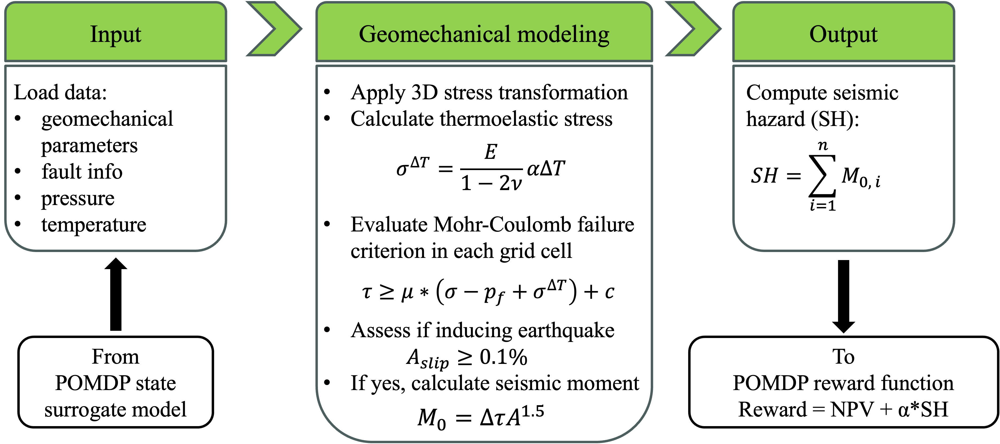

# SHAforPOMDP
This repository hosts the code for Seismic Hazard Assessment for the geothermal POMDP. Based on the fault slip modeling techniques, seismic hazard is quantified by estimating the total seismic moment for a geothermal reservoir. The seismic hazard is fed to the geothermal POMDP reward function to allow for capturing seismic risk in field development planning. 
Below shows the workflow:

